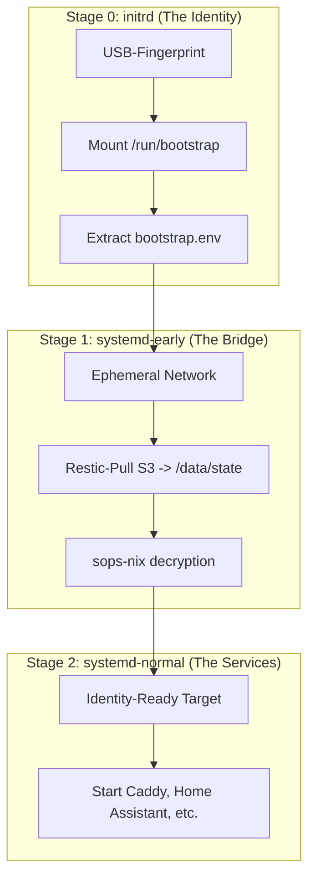

# Architecture: 3-Stage-Boot-Pipeline (NMS v4.2)

## 1. User Layer (KISS)
Dieses Dokument definiert den heiligen Gral des Systemstarts für deinen NixOS-Server. Wir haben den Bootvorgang in drei klare Phasen unterteilt, um das "Henne-Ei-Problem" (Netzwerk braucht Passwörter, Passwörter brauchen Netzwerk) endgültig zu lösen. Das System erkennt seinen USB-Stick, baut eine gesicherte Internetverbindung auf, lädt deine aktuellsten Einstellungen aus der Cloud und startet erst dann die eigentlichen Dienste.

## 2. Technical Layer (Aviation-Grade)

### Die 3-Stage Architektur

### Implementierung: Stage-0 (initrd-bootstrap.nix)
Identifikation des Master-USB via `by-label` (NIXHOME_BOOT), um Bootstrap-Credentials (WLAN-PSK, S3-Read-Keys) bereitzustellen, bevor die Hauptverschlüsselung aktiv wird.
*   **ID:** `NIXH-00-COR-041`
*   **Logic:** Falls kein USB gefunden wird, startet eine Emergency-Shell mit TTY1-Hinweis.

### Implementierung: Stage-1 (Vault-to-Cloud Bridge)
*   **nixhome-bootstrap-network.service:** Nutzt die extrahierten Credentials für eine temporäre Internetverbindung.
*   **nixhome-restic-pull.service:** Synchronisiert den verschlüsselten Vault aus der Cloud nach `/data/state/vault`.
*   **sops-install-secrets.service:** Wartet zwingend auf den Restic-Pull, um die soeben heruntergeladenen Secrets zu entschlüsseln.

## 3. Reasoning Layer (History)

### [ADR-006] 3-Stage Boot Sequence
*   **Status:** Entschieden (März 2026).
*   **Kontext:** Frühere Versuche, alles in der `initrd` zu lösen, scheiterten an der Komplexität von Netzwerk-Stacks und Cloud-Clients in einer minimalen RAM-Disk Umgebung.
*   **Entscheidung:** Verschiebung der Cloud-Synchronisation in eine "Early-Systemd" Phase (Stage 1). Nur die minimalsten Identitätsmerkmale verbleiben in Stage 0 (USB-Label Check).
*   **Konsequenzen:** Erhöhte Stabilität und bessere Debugging-Möglichkeiten (da volles systemd-Journal in Stage 1 verfügbar).
*   **Verworfene Alternativen:** `[SUPERSEDED]` WLAN-Keys direkt im Nix-Store: Abgelehnt, da dies die Souveränität verletzen würde (Secrets im Klartext im Store).

---
**Sources:**
*   `/home/Knowledge-Pipeline/raw/_duplikate/Claude-NMS v4.2 sovereign identity implementation strategy.md`
*   `/home/Knowledge-Pipeline/raw/_duplikate/NMS_v4.2_SOVEREIGN_IDENTITY_AUDIT.md`
