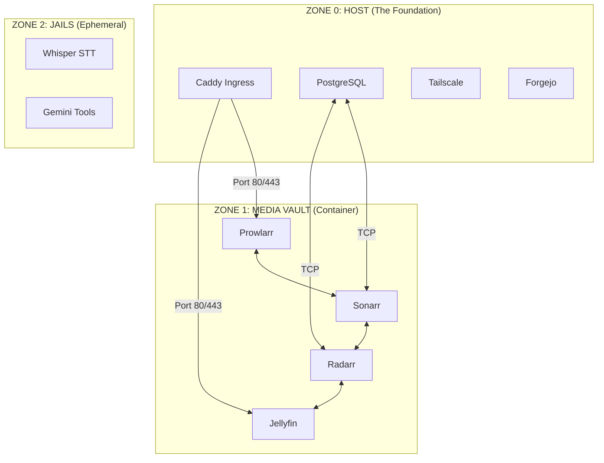

# [MAP]: MyNixOS Service Map
# ID: [NUGGET-SRE-017] | Stand: 10.03.2026

Diese Karte zeigt, wie die Zonen ineinandergreifen.

---
> [ARCHITECT-NOTE]: Diese Struktur minimiert die "Falschstrick-Gefahr", da die Grenzen klar definiert sind.
